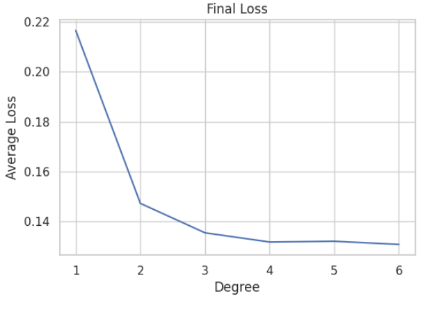

# Machine Learning Project 1

## Table of Contents

- [Overview](#overview)
- [Polynomial Regression](#polynomial-regression)
- [kNN](#knn)
- [Natural Language Proccessing](#natural-language-proccessing)
- [Dependencies](#dependencies)

## Overview
This repository contains solutions to machine learning problems assigned in college project. The project consists of three main problems: Polynomial Regression analysis, k-Nearest Neighbors (kNN) classification, and Natural Language Processing (NLP) for tweet classification.

## Polynomial Regression
This task provides insights into the effectiveness of polynomial regression and the impact of regularization in predicting water temperature based on salinity.
We're going to use polynomial regression on data from ocean water tests, which we've got stored in a file called ```bottle.csv```.

### Problem 1a: Polynomial Regression
In this task we will try to fit curves of different degrees, from simple straight lines to more wiggly shapes. We'll plot all our data points along with the curves our polynomial regression. It shows how model tries to capture the relationship between salinity and temperature.

<p float="left">
  
  
</p>

### Problem 1b: Polynomial Regression with L2 Regularization
Next up, we're going to add regularization. We're sticking with degree 4 for our polynomials, but now we're throwing in some L2 regularization to keep things in check.

<p float="left">


</p>

## kNN
In this task we have a dataset called ```iris.csv```, which contains information about three types of iris flowers. Our goal is to classify them into one of the three categories based on four specific properties. Through exploration, we gain valuable insights into the classification of iris flowers using the k-NN algorithm by examining the impact of different parameters and features.

### Problem 2a: Initial Classification with kNN
First off, we need to split our iris dataset into a training set and a test set. We'll also apply the k-NN algorithm, focusing only on the first two features, with k=3.


### Problem 2b: Tuning the k Parameter
Next, we'll continue with the first two features but experiment with different values of the k parameter, ranging from 1 to 15.


### Problem 2c: Including All Features
Now, we will expand our analysis by including all available features from the original dataset. We'll start from where we left off in part b.


## Natural Language Processing
We have a dataset called ```disaster-tweets.csv```, containing tweets for classification. Our goal is to clean the dataset, create feature vectors, split it into training and test sets (80:20 ratio), and fit a Multinomial Naive Bayes model. We aim for an accuracy of at least 80% on the test set.

### Part 1: Preparing Data and Model Training
We'll start by cleaning the dataset and creating feature vectors. Then, we'll split the dataset into training and test sets. Next, we'll fit a Multinomial Naive Bayes model to the training data and evaluate its accuracy on the test set. We'll ensure that the accuracy meets our minimum requirement by averaging it over three consecutive runs.

### Part 2: Exploring Word Frequency and LR Metric
In this part, we'll identify the five most common words in positive tweets and negative tweets. We'll also calculate the LR metric for each word, defined as the ratio of the word's occurrence in positive tweets to its occurrence in negative tweets. We'll find the 5 words with the highest and lowest LR metric values (for words occurring at least 10 times in both positive and negative tweets after data cleaning).

## Dependencies
- pandas
- tensorflow
- matplotlib
- numpy
- seaborn
- nltk
